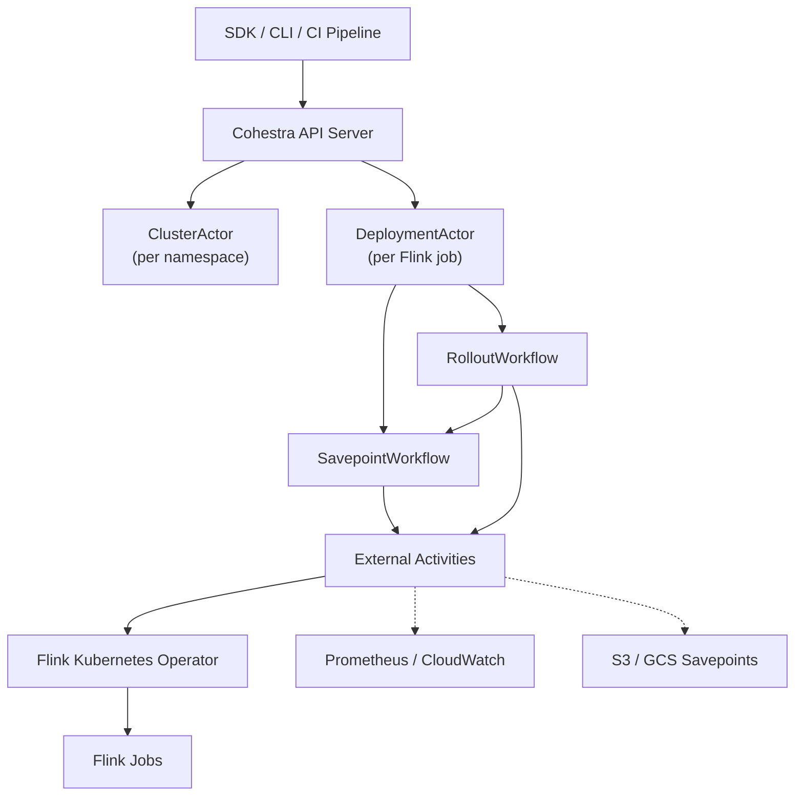

<div align="center">
  
  <h1>Cohestra</h1>
  <p><strong>Open-source control plane for Apache Flink on Kubernetes</strong></p>

  <p>
    <a href="LICENSE"></a>
    
    
    
    <a href="https://cohestra.dev/docs"></a>
  </p>

  <p>
    Replace AWS Managed Service for Apache Flink · Replace Flink Operator autoscaler<br/>
    <b>One Helm install on your EKS cluster. No paid services.</b>
  </p>
</div>

---

Cohestra is an **Apache 2.0-licensed** Go library and reference control plane for operating stateful Apache Flink deployments with [Temporal](https://temporal.io). It uses the **actor model** — the same pattern [Netflix uses to orchestrate 12,000+ Flink clusters](https://temporal.io/resources/on-demand/actor-workflows-reliably-orchestrating-thousands-of-flink-clusters-at).

Deploy it with a single `helm install` on your EKS cluster. Build custom autoscalers with the SDK. No vendor lock-in, no per-KPU pricing, no paid services.

> Apache Flink and Flink are trademarks of The Apache Software Foundation. Cohestra is independent and is not affiliated with or endorsed by The Apache Software Foundation.

## Why Cohestra?

| Problem | Managed Services / Operator | Cohestra |
|---|---|---|
| **Cost** | AWS MSF: ~$0.11/KPU-hour (~$630/mo per job) | Your Kubernetes nodes only |
| **Vendor Lock-in** | Locked to one cloud provider | Any Kubernetes: EKS, GKE, AKS, on-prem |
| **Flink Version Lag** | Months behind open source | Day-one support for any Flink version |
| **Autoscaling** | Operator: rescaling storms, opaque logic | Your code, your metrics, your thresholds |
| **Observability** | CloudWatch logs / black box | Full durable operation history via Temporal |
| **Rollback** | Manual redeploy | One-command automatic rollback with savepoints |
| **Incident Response** | No cluster freeze | Namespace-level mutation freeze |

## Key Features

- **Controlled Rollouts** — Savepoint-gated deployments with automatic health checks (checkpoint, restart, backpressure, Kafka lag, sink) and automatic rollback on failure
- **Custom Autoscaler SDK** — Replace the Flink Operator autoscaler with your own logic using Python, Go, or Java SDKs. React to Kafka lag (CloudWatch MSK / Confluent), TaskManager CPU, or any metric
- **MCP Server** — AI coding assistants (Claude, Cursor, Copilot) can query and operate Flink deployments directly via the [Model Context Protocol](https://modelcontextprotocol.io)
- **Safety Guardrails** — Idempotency keys, prod approval gates, state-compatibility checks, capacity leases, and conservative change classification
- **Durable History** — Every deploy, scale, rollback, and savepoint tracked as a Temporal workflow with full audit trail
- **Cluster Freeze** — Namespace-level mutation freeze during incidents (savepoints still allowed)
- **GitOps Ready** — API-driven, idempotent operations with `Idempotency-Key` headers. Plug into any CI/CD pipeline

## Architecture

Cohestra implements the [**actor model via Temporal workflows**](https://temporal.io/resources/on-demand/actor-workflows-reliably-orchestrating-thousands-of-flink-clusters-at) — each Flink deployment gets a dedicated long-running actor that serializes all operations and maintains version history.



**Actor Workflow IDs** (stable, one-per-resource):
```
flink-cluster/<env>/<namespace>
flink-deployment/<env>/<namespace>/<name>
flink-rollout/<env>/<namespace>/<name>/<operationId>
flink-savepoint/<env>/<namespace>/<name>/<operationId>
```

## Quick Start

### Helm Install on EKS

```bash
helm repo add cohestra https://cohestra-project.github.io/charts
helm install cohestra cohestra/cohestra \
  --namespace cohestra-system --create-namespace \
  --set temporal.enabled=true
```

### Register & Deploy Your First Flink Job

```bash
# Register
curl -X PUT http://localhost:8080/api/v1/deployments/prod/streaming/orders \
  -H 'Content-Type: application/json' \
  -d '{"owner":"platform-team","serviceAccount":"flink","nodePool":"default"}'

# Deploy
curl -X POST http://localhost:8080/api/v1/deployments/prod/streaming/orders/deploy \
  -H 'Content-Type: application/json' \
  -H 'Idempotency-Key: deploy-001' \
  -d '{
    "requester":"ci-pipeline",
    "approved":true,
    "spec":{
      "imageDigest":"registry.example/orders@sha256:abc123",
      "flinkVersion":"2.2",
      "parallelism":8,
      "maxParallelism":128,
      "resources":{"taskManagerCpu":2,"taskManagerMemoryMiB":4096,"taskManagerCount":2,"slotsPerManager":4},
      "stateCompatibility":{"jobGraphCompatible":true,"operatorUidsStable":true}
    }
  }'
```

### Local Development

```bash
# Requirements: Go 1.24+, Docker, Docker Compose
docker compose --profile app up --build

# Endpoints:
# Cohestra Console:  http://localhost:8080
# Control API:      http://localhost:8080/api/v1
# Swagger UI:       http://localhost:8080/swagger
# Temporal UI:      http://localhost:8088
```

## Multi-Language SDKs

<table>
<tr>
<td width="33%">

**Python**
```bash
pip install cohestra-sdk
```

```python
from cohestra_sdk import CohestraClient

client = CohestraClient("http://localhost:8080")
orders = client.deployment("prod", "streaming", "orders")
orders.deploy(spec, requester="ci")
orders.wait_healthy(timeout=300)
```

</td>
<td width="33%">

**Go**
```bash
go get github.com/cohestra-project/cohestra-sdk-go
```

```go
client := cohestra.NewClient("http://localhost:8080")
d := client.Deployment("prod", "streaming", "orders")
d.Deploy(ctx, spec)
d.WaitHealthy(ctx, 5*time.Minute)
```

</td>
<td width="34%">

**Java**
```xml
<dependency>
  <groupId>io.cohestra</groupId>
  <artifactId>cohestra-sdk</artifactId>
  <version>0.1.0</version>
</dependency>
```

```java
var client = new CohestraClient("http://localhost:8080");
var orders = client.deployment("prod", "streaming", "orders");
orders.deploy(spec, "ci", true, "release v2.3.1");
```

</td>
</tr>
</table>

## MCP Server — AI Assistant Integration

Connect Claude, Cursor, or any MCP-compatible assistant to your Flink control plane:

```bash
pip install "mcp[cli]" cohestra-sdk
COHESTRA_BASE_URL=http://localhost:8080 python3 mcp/server.py
```

Or add to `.claude/settings.json`:

```json
{
  "mcpServers": {
    "cohestra": {
      "command": "python3",
      "args": ["mcp/server.py"],
      "env": { "COHESTRA_BASE_URL": "http://localhost:8080" }
    }
  }
}
```

Then ask your assistant: _"Scale prod/streaming/orders to parallelism 16"_ or _"Roll back the orders deployment — the latest deploy is bad."_

See the full [MCP Server docs](https://cohestra.dev/docs/mcp).

## Custom Autoscaler — Replace the Flink Operator Autoscaler

The Flink Kubernetes Operator autoscaler has known stability issues — rescaling storms, flapping under bursty load, opaque decision-making. Cohestra gives you full control:

```python
from cohestra_sdk import CohestraClient, AutoscalerBase, ScaleDecision

class KafkaLagAutoscaler(AutoscalerBase):
    """Scale based on Kafka consumer lag — works with MSK, Confluent, or any Kafka."""

    def evaluate(self, status):
        lag = status["currentVersion"]["healthSummary"]["kafkaLag"]
        current = status["currentVersion"]["spec"]["parallelism"]

        if lag > 100_000 and current < 64:
            return ScaleDecision(min(current * 2, 64), reason=f"lag={lag:,}")
        if lag < 10_000 and current > 2:
            return ScaleDecision(max(current // 2, 2), reason="lag low")
        return None

# Run as Lambda (one-shot), CronJob, or loop
scaler = KafkaLagAutoscaler(client, "prod", "streaming", "orders")
scaler.run_loop(interval=60)
```

Deploy as **AWS Lambda + EventBridge**, **Kubernetes CronJob**, or a **long-running Pod**. Use any metric source: CloudWatch MSK `SumOffsetLag`, Confluent Metrics API, Prometheus, Datadog, or custom business metrics.

See the full [Autoscaling Guide](https://cohestra.dev/docs/autoscaling/overview).

## Comparison

### Cohestra vs AWS Managed Service for Apache Flink

| Feature | AWS MSF | Cohestra |
|---|---|---|
| Infrastructure | AWS-managed, no cluster access | Any Kubernetes (EKS, GKE, AKS, on-prem) |
| Flink Version | Managed, months behind | Any version — you control the image |
| Autoscaling | Basic KPU-based | Custom SDK — any metric, any logic |
| Rollback | Manual redeploy | One-command with savepoint preservation |
| State Management | Opaque S3 buckets | You own checkpoints and savepoints |
| Cost | ~$0.11/KPU-hour | Kubernetes node cost only |
| Vendor Lock-in | High | **None** |
| License | Proprietary | **Apache 2.0** |

### Cohestra vs Flink Operator Autoscaler

| Feature | Operator Autoscaler | Cohestra Autoscaler SDK |
|---|---|---|
| Stability | Rescaling storms under bursty load | You control cooldown and thresholds |
| Metrics | Limited to Flink JMX | Any source (CloudWatch, Prometheus, Confluent) |
| Logic | Fixed algorithm | Your code, your rules |
| Observability | Opaque decisions | Full Temporal audit trail |
| Deployment | Coupled to Operator | Independent Lambda / CronJob / Pod |

## Safety Behavior

- Every deployment command requires `Idempotency-Key`
- Prod operations classified as risky require approval
- Max-parallelism decreases are rejected after state exists
- Stateful changes create a savepoint before apply
- Resource-increasing changes acquire a time-bound capacity lease
- Failed health gates automatically rollback to the previous healthy version
- Savepoints remain allowed while a cluster is frozen; runtime mutations do not

## ⚙️ Configuration

| Variable | Default | Purpose |
|---|---|---|
| `TEMPORAL_ADDRESS` | `localhost:7233` | Temporal frontend |
| `TEMPORAL_NAMESPACE` | `default` | Temporal namespace |
| `ACTOR_TASK_QUEUE` | `flink-control-actors` | Actor and child workflows |
| `ACTIVITY_TASK_QUEUE` | `flink-control-activities` | External I/O activities |
| `HTTP_ADDRESS` | `:8080` | API listen address |
| `SIMULATION_DELAY` | `100ms` | Simulated external call latency |
| `CONTINUE_AS_NEW_AFTER` | `500` | Commands before actor compaction |

## Documentation

| Resource | Link |
|---|---|
| **Getting Started** | [cohestra.dev/docs/getting-started](https://cohestra.dev/docs/getting-started) |
| **Architecture** | [cohestra.dev/docs/architecture](https://cohestra.dev/docs/architecture) |
| **API Reference (Swagger)** | [cohestra.dev/docs/api-reference](https://cohestra.dev/docs/api-reference) |
| **Autoscaling Guide** | [cohestra.dev/docs/autoscaling/overview](https://cohestra.dev/docs/autoscaling/overview) |
| **EKS Deployment** | [cohestra.dev/docs/eks-deployment](https://cohestra.dev/docs/eks-deployment) |
| **Scaling to 10,000 Jobs** | [docs/SCALING.md](docs/SCALING.md) |
| **Python SDK** | [cohestra.dev/docs/sdk/python](https://cohestra.dev/docs/sdk/python) |
| **Go SDK** | [cohestra.dev/docs/sdk/go](https://cohestra.dev/docs/sdk/go) |
| **Java SDK** | [cohestra.dev/docs/sdk/java](https://cohestra.dev/docs/sdk/java) |
| **MCP Server** | [cohestra.dev/docs/mcp](https://cohestra.dev/docs/mcp) |

## Use as a Library

```bash
go get github.com/cohestra-project/cohestra
```

Implement the `activities.Backend` interface and register with Temporal workers:

```go
activityWorker := worker.New(temporalClient, "flink-control-activities", worker.Options{})
cohestra.RegisterActivities(activityWorker, backend)

workflowWorker := worker.New(temporalClient, "flink-control-actors", worker.Options{})
cohestra.RegisterWorkflows(workflowWorker)
```

The `activities.Backend` interface is the production integration boundary. Community adapters may live in this repository or separate modules. Enterprise adapters may remain proprietary while consuming the same public core.

## License

Cohestra is licensed under the **[Apache License 2.0](LICENSE)**.

```
Copyright 2026 Cohestra Contributors

Licensed under the Apache License, Version 2.0 (the "License");
you may not use this file except in compliance with the License.
You may obtain a copy of the License at

    http://www.apache.org/licenses/LICENSE-2.0
```

**What this means for you:**
- Free to use commercially
- Free to modify and distribute
- Free to use in proprietary products
- Patent grant included
- No viral licensing — your extensions stay yours

## Project Status

Cohestra is **pre-v1**. Public Go APIs and Temporal contracts may change between minor releases until `v1.0.0`; changes will be documented in [CHANGELOG.md](CHANGELOG.md).

## Contributing

Contributions are welcome under the Apache License 2.0. See [CONTRIBUTING.md](CONTRIBUTING.md), [GOVERNANCE.md](GOVERNANCE.md), and [SECURITY.md](SECURITY.md).

---

<div align="center">
  <p>
    <a href="https://cohestra.dev/docs">Documentation</a> ·
    <a href="https://cohestra.dev/docs/api-reference">API Reference</a> ·
    <a href="https://cohestra.dev/docs/autoscaling/overview">Autoscaling Guide</a> ·
    <a href="https://github.com/cohestra-project/cohestra/issues">Report Bug</a>
  </p>
</div>
